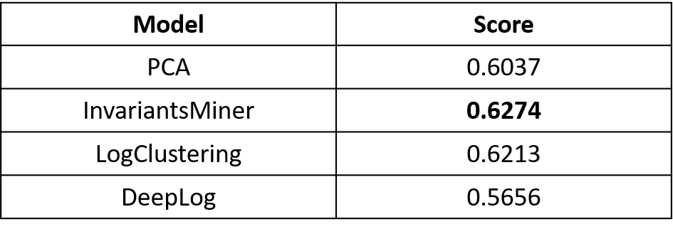

# Log Anomaly Detection

Code repository for our solution to the [Huawei Log Anomaly Detection Challenge](https://competition.huaweicloud.com/information/1000041371/introduction?track=112)

In this repository, we follow the pipeline of [LOGPAI](https://github.com/logpai) and make some modifications according to the characteristics of the dataset from Huawei.

Please refer to the ```main.py``` for how to run the code.

Results using different models are as follows:

